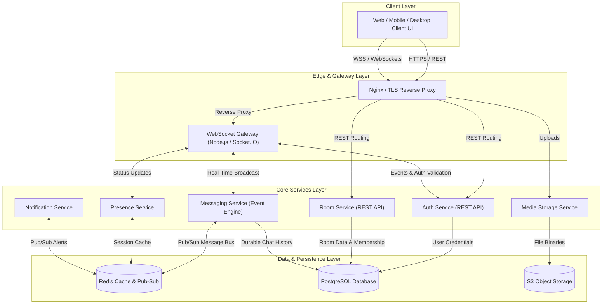
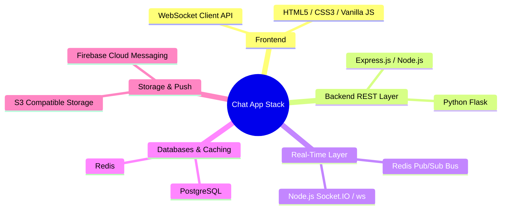
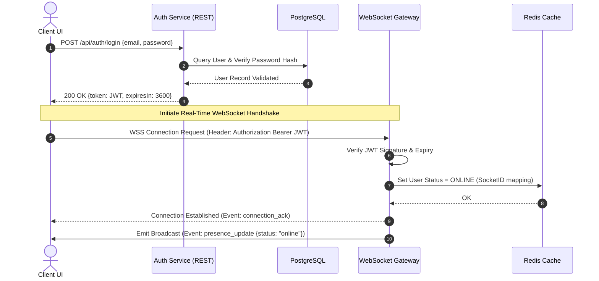
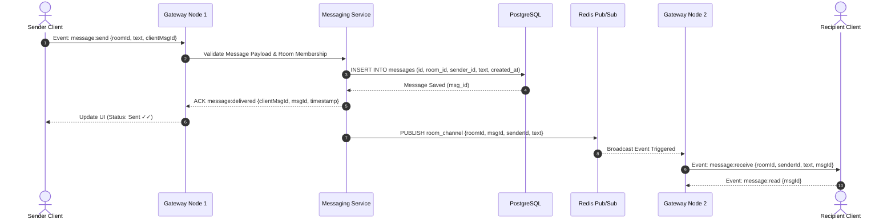

# 🏗️ Real-Time Chat Application — Software Architecture & Design (SAD) Specification

[](./Team_5_SAD_Chat_Application.pdf)
[](https://github.com/SE-Mini-Proj/SAD_Chat_Application/actions)
[](#-sprint-1-development--testing-suite)
[](#35-chosen-architecture-pattern--rationale)
[](#36-technology-stack--data-stores)
[](#36-technology-stack--data-stores)
[](./Team_5_SAD_Chat_Application.pdf)

> **Document Reference:** SAD-CHAT-2026-V1.0  
> **Project:** Real-Time Chat Application (Socket Programming)  
> **Date:** September 14, 2026  
> **Repository:** [SE-Mini-Proj / SAD_Chat_Application](https://github.com/SE-Mini-Proj/SAD_Chat_Application)

---

## 📌 Metadata & Team Contributions

### 👥 Team Members & Responsibilities

| Name | SRN | Contribution |
| :--- | :--- | :--- |
| **Pranay Shah** | `PES2UG24CS366` | Sections 1–2 (Introduction, Document Overview), Section 3.1–3.2 (Goals & Constraints, Stakeholders & Concerns); overall document structuring, compilation, formatting, and final architectural review. |
| **Nikhil Mahabala Shekar** | `PES2UG24CS318` | Section 3.3–3.6 (UML Component Diagram, Component Descriptions, Architecture Pattern & Rationale, Technology Stack & Data Stores). |
| **Prarthana Herur** | `PES2UG24CS367` | Section 3.7–3.9 (Risk Register & Mitigations, Traceability Matrix to Requirements, Security Architecture / STRIDE Threat Modeling). |
| **Nikhil B Menon** | `PES2UG24CS317` | Section 4 (Design Overview, UML Sequence Diagrams, API Design & Envelopes, Error Handling/Logging/Monitoring, UX Design, Open Issues & Future Roadmap). |

---

### 📜 Revision History

| Version | Date | Author(s) | Change Summary | Approval Status |
| :---: | :---: | :--- | :--- | :---: |
| **`1.0`** | 14-09-2026 | Pranay Shah, Nikhil Mahabala Shekar, Prarthana Herur, Nikhil B Menon | Initial SAD drafted for Chat Application project | `Pending` |

---

### ✍️ Approvals

| Role | Name | Signature / Email | Date |
| :--- | :--- | :---: | :---: |
| **Course Coordinator** | *TBD* | — | — |
| **Faculty Guide** | *TBD* | — | — |

---

## 📑 Table of Contents

- [1. Introduction](#1-introduction)
  - [1.1 Purpose](#11-purpose)
  - [1.2 Scope](#12-scope)
  - [1.3 Audience](#13-audience)
  - [1.4 Definitions, Acronyms and Abbreviations](#14-definitions-acronyms-and-abbreviations)
- [2. Document Overview](#2-document-overview)
  - [2.1 How to Use This Document](#21-how-to-use-this-document)
  - [2.2 Related Deliverables & Documents](#22-related-deliverables--documents)
- [3. Architecture & System Topography](#3-architecture--system-topography)
  - [3.1 Architectural Goals & Constraints](#31-architectural-goals--constraints)
  - [3.2 Stakeholders & Key Concerns](#32-stakeholders--key-concerns)
  - [3.3 UML Component Architecture Diagram](#33-uml-component-architecture-diagram)
  - [3.4 Component Descriptions](#34-component-descriptions)
  - [3.5 Chosen Architecture Pattern & Rationale](#35-chosen-architecture-pattern--rationale)
  - [3.6 Technology Stack & Data Stores](#36-technology-stack--data-stores)
  - [3.7 Risk Register & Mitigations](#37-risk-register--mitigations)
  - [3.8 Requirements Traceability Matrix (RTM Mapping)](#38-requirements-traceability-matrix-rtm-mapping)
  - [3.9 Security Architecture & STRIDE Threat Model](#39-security-architecture--stride-threat-model)
- [4. Detailed Design Artifacts](#4-detailed-design-artifacts)
  - [4.1 Design Overview](#41-design-overview)
  - [4.2 Dynamic Behavioral Sequence Diagrams](#42-dynamic-behavioral-sequence-diagrams)
  - [4.3 API Design & Interface Specifications](#43-api-design--interface-specifications)
  - [4.4 Cross-Cutting Concerns: Error Handling, Logging & Monitoring](#44-cross-cutting-concerns-error-handling-logging--monitoring)
  - [4.5 User Experience (UX) Architecture](#45-user-experience-ux-architecture)
  - [4.6 Open Issues & Architectural Roadmap](#46-open-issues--architectural-roadmap)
- [5. Appendices](#5-appendices)
  - [5.1 Glossary](#51-glossary)
  - [5.2 References & Standards](#52-references--standards)
  - [5.3 Tools & Technologies](#53-tools--technologies)

---

## 1. Introduction

### 1.1 Purpose
This document specifies the **Software Architecture and Design Specification (SAD)** for the **Real-Time Chat Application**, a high-performance messaging system implemented using socket programming (**WebSockets**). It details the system's overall architectural pattern, component topology, sequence flows, data models, interface definitions, security design (STRIDE), and operational considerations to guide engineers, evaluators, and system integrators during implementation and evaluation.

### 1.2 Scope
The scope encompasses the end-to-end architectural blueprints for:
* **Real-time 1-on-1 & Group Messaging:** Low-latency event delivery using WebSocket Gateway instances backed by Redis Pub/Sub.
* **Session & Connection Management:** Token-based authentication (JWT) over REST and persistent WebSocket connection lifecycles.
* **Presence & State Tracking:** Distributed online/offline status tracking and real-time typing indicators.
* **Message Persistence & Media Storage:** Durable message history in PostgreSQL and media attachment handling via object storage.
* **Security & Moderation:** Role-Based Access Control (RBAC), TLS encryption, rate limiting, and push notifications for offline users.

*Out of scope for v1.0:* WebRTC peer-to-peer audio/video streaming and third-party enterprise bridge integrations (Slack/Teams).

### 1.3 Audience
This document is targeted toward **Backend Developers**, **Frontend Engineers**, **QA & DevOps Engineers**, **Security Auditors**, and **Academic Instructors/Evaluators**.

### 1.4 Definitions, Acronyms and Abbreviations
| Term | Expansion / Meaning |
| :--- | :--- |
| **WS / WSS** | WebSocket / WebSocket Secure Protocol (RFC 6455) |
| **JWT** | JSON Web Token (RFC 7519) |
| **Pub/Sub** | Publish/Subscribe messaging pattern |
| **RBAC** | Role-Based Access Control |
| **STRIDE** | Threat Modeling Framework (Spoofing, Tampering, Repudiation, Info Disclosure, DoS, Elevation of Privilege) |
| **RTT** | Round-Trip Time |
| **XSS** | Cross-Site Scripting |

---

## 2. Document Overview

### 2.1 How to Use This Document
This SAD serves as the authoritative blueprint for translating Software Requirements (SRS) into executable software modules:
- **System Designers & Architects:** Reference [Section 3](#3-architecture--system-topography) for component splits, technology stack choices, and threat mitigation strategies.
- **Developers & Integrators:** Reference [Section 4](#4-detailed-design-artifacts) for sequence diagrams, REST endpoints, and WebSocket payload schemas.
- **DevOps & QA:** Reference [Section 4.4](#44-cross-cutting-concerns-error-handling-logging--monitoring) for structured logging formats, health metrics, and error codes.

### 2.2 Related Deliverables & Documents
- 📄 **Software Architecture Document (PDF):** [Team 5 SAD Document](./Team_5_SAD_Chat_Application.pdf)
- 📄 **Software Requirements Specification (SRS):** [SE-Mini-Proj / SRS](https://github.com/SE-Mini-Proj/SRS)
- 📄 **Software Test Plan (STP):** [SE-Mini-Proj / TEST](https://github.com/SE-Mini-Proj/TEST)

---

## 3. Architecture & System Topography

### 3.1 Architectural Goals & Constraints

#### Key Architectural Goals
1. **Sub-Second Delivery Latency:** End-to-end message transmission under **1 second** for online connected clients.
2. **Horizontal Scalability:** Support scaling out connection-heavy WebSocket Gateways independently using load balancing and Redis Pub/Sub.
3. **High Availability (99.5%):** Graceful recovery from Gateway node failures without loss of persistent state.
4. **Secure-by-Design:** End-to-end encryption in transit (TLS 1.2+), tokenized sessions, and zero plain-text storage of credentials.

#### System Constraints
- **Target Concurrency:** Minimum **500 concurrent WebSocket connections** per server node instance.
- **Protocol Enforceability:** All WebSocket connections must handshake over WSS (HTTPS port upgrade).
- **Payload Limits:** Message text limited to 4KB; file attachments capped at 25MB per upload.

---

### 3.2 Stakeholders & Key Concerns

| Stakeholder Role | Primary Architectural Concerns |
| :--- | :--- |
| **End Users** | Low-latency message delivery, reliable history sync, dynamic presence indicators, and private communication. |
| **Room Owners / Moderators** | Granular channel permissions, instant moderation controls (mute/kick/ban), and audit visibility. |
| **Platform Administrators** | System uptime, low resource consumption, transparent metrics/alerting, and painless deployment. |
| **Developers & Maintainers** | Loose coupling, clear API contracts, modular component boundaries, and high unit test coverage. |

---

### 3.3 UML Component Architecture Diagram

The system employs an **Event-Driven Service Split** topology where real-time socket connections are decoupled from stateless REST APIs and background storage workers.



---

### 3.4 Component Descriptions

| Component Name | Architectural Responsibility | Primary Protocol / Tech |
| :--- | :--- | :--- |
| **Client UI** | Renders interactive chat UI, maintains persistent WebSocket connection, handles client-side state & auto-reconnect. | HTML5 / JavaScript / WebSockets |
| **Auth Service (REST)** | Handles user registration, authentication credential checks, and issues signed JWT tokens. | Express.js / Node.js |
| **WebSocket Gateway** | Manages persistent TCP/WSS connections, validates JWT tokens during handshakes, and routes real-time events. | Socket.IO / Node.js (`ws`) |
| **Room Service (REST)** | Manages room creation, membership permissions, invite codes, and member rosters. | Express.js / Node.js |
| **Messaging Service** | Validates message payloads, persists messages to PostgreSQL, and publishes events to Redis for cluster broadcast. | Node.js / Python |
| **Presence Service** | Tracks online/offline/typing states per user and caches active sockets in Redis. | Redis / Node.js |
| **Media Storage Service** | Accepts file uploads, checks file types/size limits, and stores attachments securely. | REST / AWS S3 Compatible |
| **Notification Service** | Triggers offline push alerts via Firebase Cloud Messaging (FCM) when recipients are disconnected. | FCM API / Redis Pub-Sub |
| **PostgreSQL Database** | Relational storage for user accounts, room topologies, member permissions, and chat message history. | PostgreSQL 15+ |
| **Redis Cache / Pub-Sub** | High-speed ephemeral store for presence, session state, and cross-instance Pub/Sub message broker. | Redis 7+ |

---

### 3.5 Chosen Architecture Pattern & Rationale

```
+-----------------------------------------------------------------------------+
|                      ARCHITECTURAL TRADE-OFF ANALYSIS                       |
+--------------------------+--------------------------------------------------+
| Architecture Pattern     | Evaluation & Rationale                           |
+--------------------------+--------------------------------------------------+
| ❌ Layered Monolith       | Rejected: Tightly couples WebSocket connection  |
|                          | state to business logic, preventing horizontal   |
|                          | gateway scaling under connection bursts.         |
|                          |                                                  |
| ❌ Microservices Mesh    | Rejected: Excessive operational complexity      |
|                          | (service mesh, distributed tracing overhead)     |
|                          | for targeted project scope.                      |
|                          |                                                  |
| ✅ Event-Driven Service  | CHOSEN: Combines lightweight REST APIs for setup |
|    Split (Redis Pub/Sub) | with scalable WebSocket Gateways sharing a Redis |
|                          | event backbone. Optimal balance of performance.  |
+--------------------------+--------------------------------------------------+
```

---

### 3.6 Technology Stack & Data Stores



---

### 3.7 Risk Register & Mitigations

| Risk ID | Identified Risk | Impact Level | Architectural Mitigation Strategy |
| :---: | :--- | :---: | :--- |
| **R-01** | WebSocket Gateway overload under high connection concurrency | **HIGH** | Horizontal scaling of Gateway nodes behind a load balancer using sticky sessions & Redis Pub/Sub broadcast. |
| **R-02** | Message drop during unexpected server node crash | **HIGH** | Persist message to PostgreSQL *before* acknowledging receipt to sender (`at-least-once` delivery guarantee). |
| **R-03** | Cross-Site Scripting (XSS) via injected message payloads | **HIGH** | Strict server-side HTML entity sanitization & escaping before storage and client rendering. |
| **R-04** | Unauthorized room access or moderator privilege escalation | **MEDIUM** | JWT verification on every WebSocket frame; strict server-side Role-Based Access Control (RBAC). |
| **R-05** | Network disconnection or silent connection dropping | **MEDIUM** | Client-side auto-reconnect with exponential backoff + heartbeat ping/pong connection pruning on server. |

---

### 3.8 Requirements Traceability Matrix (RTM Mapping)

| SRS Requirement ID | Requirement Description | Primary Architecture Component(s) |
| :---: | :--- | :--- |
| **CHAT-F-002** | User Registration & JWT Authentication | Auth Service (REST API), PostgreSQL |
| **CHAT-F-011** | Real-Time Direct Message Delivery | WebSocket Gateway, Messaging Service, Redis |
| **CHAT-F-022** | Broadcast Message to Room Members | Messaging Service, Room Service, Redis Pub/Sub |
| **CHAT-F-030** | Online / Offline & Typing Indicators | Presence Service, Redis Cache, WebSocket Gateway |
| **CHAT-F-041** | Paginated Message History Retrieval | Messaging Service, PostgreSQL Database |
| **CHAT-F-050** | Media & File Attachment Sharing | Media Storage Service, S3 Object Storage |
| **CHAT-F-061** | Offline User Push Notifications | Notification Service, Firebase Cloud Messaging |

---

### 3.9 Security Architecture & STRIDE Threat Model

The application security model adheres to the **STRIDE** methodology across all layers:

| STRIDE Category | Threat Description | Architecture Security Mitigation |
| :--- | :--- | :--- |
| **Spoofing** | Attacker impersonates a legitimate user socket connection. | Signed JWT validation on initial WSS handshake and every REST API call. |
| **Tampering** | In-transit modification of chat messages or session tokens. | TLS 1.2+ mandatory for WSS and HTTPS traffic; cryptographically signed JWT tokens. |
| **Repudiation** | User denies performing an administrative/moderation action. | Immutable structured audit logging containing timestamp, actor ID, and action type. |
| **Information Disclosure** | Exposure of user credentials or database records. | Argon2/bcrypt salted hashing for passwords; SSL/TLS DB connections; least-privilege DB roles. |
| **Denial of Service (DoS)** | Socket flooding or rate limit exhaustion. | Per-user rate limiting (token bucket); socket heartbeat timeouts to clear ghost connections. |
| **Elevation of Privilege** | Normal user attempts to execute room moderator actions. | Server-side RBAC validation on every room operation (never trust client claims). |

---

## 4. Detailed Design Artifacts

### 4.1 Design Overview
The system design establishes a clear boundary between **connection lifecycle state** (handled statelessly by Gateway instances using Redis) and **domain business logic** (persisted durably in PostgreSQL).

---

### 4.2 Dynamic Behavioral Sequence Diagrams

#### Sequence Diagram 1: User Login & WebSocket Connection Setup



#### Sequence Diagram 2: Send & Broadcast Group Message



---

### 4.3 API Design & Interface Specifications

#### 4.3.1 Auth Service — Login
* **Endpoint:** `POST /api/auth/login`
* **Request Payload:**
```json
{
  "email": "user@example.com",
  "password": "SecurePassword123!"
}
```
* **Success Response (`200 OK`):**
```json
{
  "status": "ok",
  "token": "eyJhbGciOiJIUzI1NiIsInR5cCI6IkpXVCJ9...",
  "user": {
    "id": "usr_987654321",
    "name": "Pranay Shah",
    "email": "user@example.com"
  },
  "expiresIn": 86400
}
```

#### 4.3.2 Room Service — Join Room
* **Endpoint:** `POST /api/rooms/:roomId/join`
* **Headers:** `Authorization: Bearer <JWT>`
* **Request Payload:**
```json
{
  "inviteCode": "GRP-2026-X9Y"
}
```
* **Success Response (`200 OK`):**
```json
{
  "status": "ok",
  "roomId": "rm_123456789",
  "roomName": "Software Engineering Team",
  "memberCount": 4
}
```

#### 4.3.3 WebSocket Gateway Interface
* **Event Outgoing (`message:send`):**
```json
{
  "roomId": "rm_123456789",
  "text": "Hey team, the SAD documentation has been published!",
  "clientMsgId": "550e8400-e29b-41d4-a716-446655440000"
}
```
* **Event Incoming (`message:receive`):**
```json
{
  "messageId": "msg_9988776655",
  "roomId": "rm_123456789",
  "senderId": "usr_987654321",
  "senderName": "Pranay Shah",
  "text": "Hey team, the SAD documentation has been published!",
  "timestamp": "2026-09-14T10:30:00.000Z"
}
```

---

### 4.4 Cross-Cutting Concerns: Error Handling, Logging & Monitoring

#### Standardized Error Envelope
All REST and WebSocket errors return a uniform JSON error envelope:
```json
{
  "error": {
    "code": "UNAUTHORIZED_ROOM_ACCESS",
    "message": "You do not have permission to send messages in this room.",
    "timestamp": "2026-09-14T10:31:00.000Z"
  }
}
```

#### Structured Privacy-First Logging
Logs are generated in JSON format and stripped of credentials or sensitive content:
```json
{
  "level": "info",
  "service": "websocket-gateway",
  "event": "MESSAGE_BROADCAST",
  "roomId": "rm_123456789",
  "senderId": "usr_987654321",
  "latencyMs": 42,
  "timestamp": "2026-09-14T10:30:00.042Z"
}
```

#### Key Observability Metrics
- **Active WebSocket Connections:** Gauge of live persistent sockets per Gateway instance.
- **p95 Message Delivery Latency:** Time taken from `message:send` emit to recipient `message:receive`.
- **Database Query Latency:** Histogram of PostgreSQL read/write operations.

---

### 4.5 User Experience (UX) Architecture
The UI is designed with an accessible, multi-column responsive grid:
- **Left Panel:** Contact list, room directory, and active status filter.
- **Center Panel:** Message stream thread, typing indicators, and message composer.
- **Right Panel:** Channel details, shared media tab, and member roster.
- **Accessibility:** High-contrast palette compliant with WCAG 2.1 AA, full keyboard tab navigation, and ARIA live regions for incoming chat messages.

---

### 4.6 Open Issues & Architectural Roadmap

- [ ] **End-to-End Encryption (E2EE):** Implementation of Signal Protocol for private direct messages.
- [ ] **WebRTC Media Support:** Signalling extension for zero-latency peer-to-peer voice and video calls.
- [ ] **Threaded Message Replies:** Sub-conversation schema updates in PostgreSQL.
- [ ] **Auto-Scaling Gateway Groups:** Dynamic Kubernetes HPA rules based on active socket connections.

---

## 5. Appendices

### 5.1 Glossary
- **WS / WSS:** Full-duplex persistent TCP communication protocol.
- **JWT:** Compact token format for stateless REST & WebSocket authentication.
- **Redis Pub/Sub:** High-throughput publish-subscribe message broker.
- **STRIDE:** Security threat modeling methodology developed by Microsoft.

### 5.2 References & Standards
1. **RFC 6455:** *The WebSocket Protocol*, IETF Standard.
2. **IEEE 42010:** *Systems and software engineering — Architecture description*.
3. **OWASP Top 10:** *Web Application Security Risks*.

### 5.3 Tools & Technologies
- **PlantUML / MermaidJS / draw.io:** Diagram creation & architecture rendering.
- **Postman & Swagger:** API schema design and contract verification.
- **Socket.IO:** Real-time event framework.

---

## 6. Sprint 1 Development, Testing Suite & CI/CD Pipeline

### 6.1 Sprint 1 Implemented Features
- **User Authentication (`src/services/authService.js`):** User registration (`POST /api/auth/register`), login (`POST /api/auth/login`), bcrypt password hashing, and signed JWT token issuance.
- **Room Management (`src/services/roomService.js`):** Public/private chat room creation, invite code checks, room rosters, and room joining.
- **WebSocket Gateway (`src/gateway/socketGateway.js`):** Persistent Socket.IO gateway with JWT handshake validation, `message:send`, `message:receive` broadcasting, and presence state updates.
- **Presence Engine (`src/services/presenceService.js`):** Online/offline status tracking and real-time typing indicators.
- **Interactive Web UI (`public/`):** Glassmorphism dark-mode UI with live chat streams, typing indicators, active contacts list, and modal room creation.

### 6.2 Test Case Development & Verification
The repository contains 32 comprehensive Unit & Integration test cases built with Jest and Supertest, covering normal flows, edge cases, boundary conditions, and unauthorized access scenarios:

- **Unit Tests (`tests/unit/`):**
  - `authService.test.js`: Valid registration/login, weak password rejection, invalid email formats, duplicate email/username handling, and JWT signature verification.
  - `roomService.test.js`: Default room initialization, public/private room creation, invite code validation, and member rosters.
  - `presenceService.test.js`: Socket presence lifecycle, online user counting, and multi-user typing indicator tracking.
- **Integration Tests (`tests/integration/`):**
  - `restApi.test.js`: End-to-end HTTP assertions (`supertest`) for `/api/health`, `/api/auth/*`, `/api/rooms/*`, `/api/rooms/:roomId/messages`, and `/api/users/online`.
  - `websocketGateway.test.js`: Live Socket.IO client-server interactions, WSS authentication handshake, message broadcasting across sockets, and typing indicators.

#### Running Tests Locally
```bash
# Execute full unit & integration test suite
npm test

# Generate code coverage report
npm run test:coverage
```

### 6.3 CI/CD Pipeline (`.github/workflows/ci.yml`)
The project utilizes **GitHub Actions** for automated Continuous Integration on every `push` and `pull_request` to `main`:
1. **Multi-Version Node Matrix:** Validates builds across Node.js `18.x`, `20.x`, and `22.x`.
2. **Automated Dependency Caching:** Fast, reproducible builds using `npm ci`.
3. **Automated Test Suite Execution:** Automatically runs all 32 Jest unit & integration tests.
4. **Coverage Generation:** Calculates coverage reports to prevent regressions.
5. **Health Check Verification:** Boots up the server and verifies `GET /api/health` returns `200 OK` before deployment.

---

<p align="center">
  <b>Chat Application Project — Team 5</b><br>
  PES University • Department of Computer Science & Engineering
</p>
